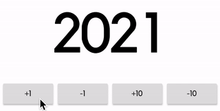
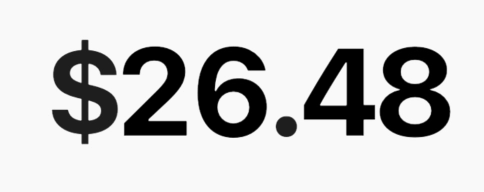

# animated_flip_counter

An implicit animation widget that flips from one number to another.

## Counter

```dart
AnimatedFlipCounter(
  duration: Duration(milliseconds: 500),
  value: _value,
  textStyle: TextStyle(fontSize: 100),
)
```



## Decimal display

```dart
AnimatedFlipCounter(
  value: _value,
  fractionDigits: 2,
  prefix: "\$",
  textStyle: TextStyle(
    fontSize: 60,
    fontWeight: FontWeight.bold,
    letterSpacing: -8.0,
  ),
)
```



## Negative values

```dart
AnimatedFlipCounter(
  value: _value,
  fractionDigits: 2,
  suffix: "%",
  textStyle: TextStyle(
      fontSize: 40,
      color: _value >= 0 ? Colors.green : Colors.red,
  ),
)
```

